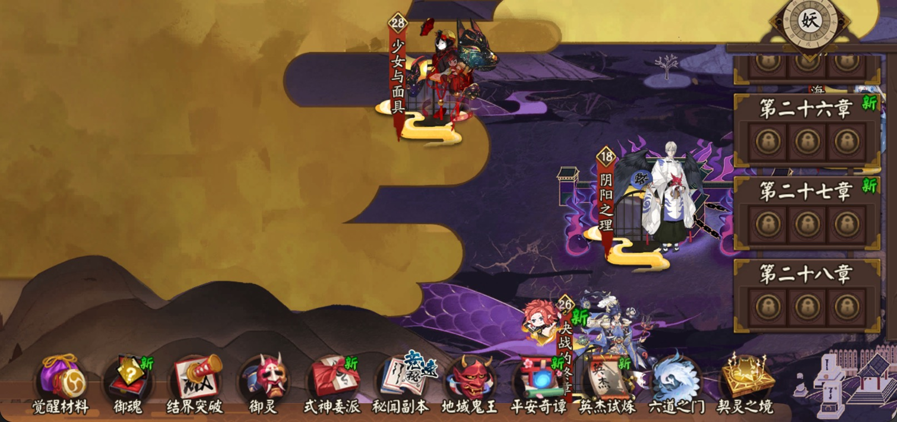

# Free Hands Onmyoji
>解放你的双手，不要让你在游戏中也要工作!  
阴阳师的自动化脚本，旨在帮助玩家自动执行游戏中的重复任务。
## 介绍
使用Golang和OpenCV+robotgo实现的自动化脚本，旨在帮助玩家自动执行《阴阳师》中的重复任务，如探索、寻怪等。该项目主要针对第28章的探索任务，使用模板匹配技术识别游戏界面元素，并通过模拟点击操作来完成任务。

## 灵感来源
本项目受[auto-click](https://github.com/WinterBokeh/auto-click)启发

## 免责声明

### 使用风险
本项目（Free-Hands-Onmyoji）是一个自动化工具，仅用于学习和研究目的。使用本工具可能违反游戏《阴阳师》的用户协议或服务条款。使用者需自行承担因使用本工具而可能导致的所有风险，包括但不限于账号封禁、游戏数据丢失等后果。

### 非官方性质
本项目与《阴阳师》游戏开发商网易游戏没有任何关联，不是官方认可的工具。这是一个由玩家创建的第三方工具。

### 无担保
本软件按"原样"提供，不提供任何形式的明示或暗示的保证，包括但不限于对适销性、特定用途适用性和非侵权性的保证。作者或版权持有人在任何情况下均不对任何索赔、损害或其他责任负责，无论是在合同诉讼、侵权行为或其他方面。

### 合理使用
我们强烈建议用户：
1. 仅将本工具用于个人学习和研究
2. 不要长时间持续使用自动化工具
3. 遵守游戏开发商的用户协议和服务条款
4. 尊重游戏开发者的知识产权和劳动成果

使用本工具即表示您已阅读、理解并同意上述免责声明的所有条款。
## Project Structure

```
free-hands-onmyoji
├── k28/                   # 保存第28章模板图片
│   ├── BaoXiang.jpg       # 宝箱图片模板
│   ├── Boss.jpg           # Boss图片模板
│   ├── JieSuan.jpg        # 结算界面图片模板
│   ├── JinRu.jpg          # 进入图片模板
│   ├── XunGuai.jpg        # 寻怪图片模板
│   └── ZhangJie.jpg       # 章节图片模板
├── main.go                # 应用程序入口点
├── Makefile               # 项目构建脚本
├── pkg/                   # 项目包结构
│   ├── enums/             # 枚举类型定义
│   │   ├── enums.go       # 枚举常量
│   │   └── enums_test.go  # 枚举测试
│   ├── events/            # 事件处理
│   │   └── exit.go        # 退出事件
│   ├── logger/            # 日志系统
│   │   └── logger.go      # 日志实现
│   ├── onmyoji/           # 阴阳师游戏相关
│   │   ├── entity/        # 实体定义
│   │   │   └── type.go    # 类型定义
│   │   ├── k28/           # 第28章相关实现
│   │   │   ├── baoxiang.go # 宝箱处理
│   │   │   ├── boss.go    # Boss战处理
│   │   │   ├── jiesuan.go # 结算界面处理
│   │   │   ├── jinru.go   # 进入章节界面处理
│   │   │   ├── registr.go # 状态注册
│   │   │   ├── tuijing.go # 移动角色
│   │   │   ├── tuijin_test.go # 移动角色测试
│   │   │   ├── xunguai.go # 寻怪处理
│   │   │   └── zhangjie.go # 章节点击处理
│   │   ├── tansuo/        # 探索相关实现
│   │   └── window/        # 窗口操作
│   │       ├── click.go   # 点击操作
│   │       └── position.go # 位置计算
│   ├── statemachine/      # 状态机
│   │   └── state_machine.go # 状态机实现
│   ├── types/             # 通用类型
│   │   └── types.go       # 类型定义
│   └── utils/             # 工具函数
│       └── tools.go       # 通用工具
├── go.mod                 # Go模块配置
├── go.sum                 # 依赖校验和
└── README.md              # 项目文档
```

## 开始运行
```shell
make run
```
### 前置条件

- Go 1.24 or later
-  opencv 4.11.0_1
-  macOS M系列

### 安装

1. Clone the repository:
   ```
   git clone https://github.com/yourusername/free-hands-onmyoji.git
   cd free-hands-onmyoji
   ```

2. Install dependencies:
   ```
   go mod tidy
   ```
3. build
   ```
   make build
   ```
### 使用方法

  - 打开BlueStacks模拟器并且进入游戏探索具体看以下图片.  
  
   
- 启动应用程序:
  ```
  make run
  ```
  程序会自动点击章节并进入探索界面，开始自动执行任务。
  中途可以任何地方按下 command + O 退出程序。


  ### FQA
    - **为什么需要使用BlueStacks模拟器？**
        - 因为该脚本依赖BlueStacks只针对了BlueStacks来获取窗口位置
    - **为什么需要使用macOS M系列？**
        - 作者是基于macOS M系列进行开发和测试的，其他平台可能需要额外的适配工作。
    - **为什么需要OpenCV？**
        - OpenCV用于图像处理和模板匹配，以识别游戏中的元素。
  -  **匹配不到图片怎么办**
        - 使用截图工具重新截图 因为位置计算和模版图片在不同的窗口大小下有区别所以需要重新截图 项目中的图片是基于作者自己的显示器+MacOS的自动4分窗口截取不是适合所有人
  - **构建报错怎么办**
      - 可能是openCV路径不正确或者是C++版本不对 需要你自行修改Makefile中的路径
  - openCV的安装
    - 如果你使用的是macOS M系列可以直接使用brew安装
      ```shell
      brew install opencv
      ```
    - 如果你使用的是其他平台请参考[OpenCV官方文档](https://opencv.org/releases/)进行安装

## Todo

- [x] 困28章的探索脚本
- [ ] 优化日志输出
- [ ] 增加更多的测试用例
- [ ] 增加御魂探索脚本
- [ ] 增加突破脚本
- [ ] 增加御灵探索脚本
## License

本项目采用MIT许可证授权，这意味着您可以自由地使用、修改和分发本软件，无论是用于个人还是商业用途，只要您保留原始版权声明。

详细条款请参阅[LICENSE](./LICENSE)文件。

```
MIT License

Copyright (c) 2025 Free-Hands-Onmyoji Contributors

Permission is hereby granted, free of charge, to any person obtaining a copy
of this software and associated documentation files...
```